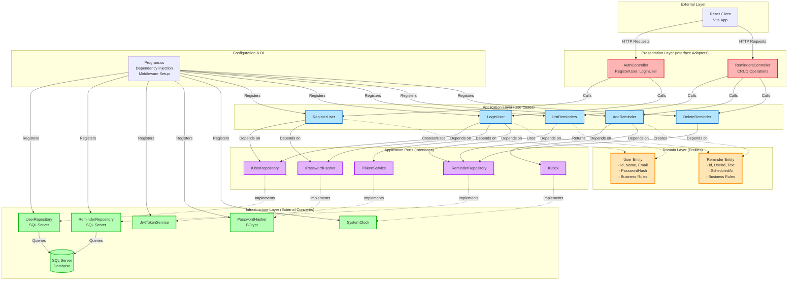

# Reminder App (Clean Architecture) — React + .NET 8 + SQL Server Express

This repository contains a minimal, runnable example implementing Clean Architecture:
- **Front end**: React (Vite)
- **Backend API**: ASP.NET Core 8 (Controllers)
- **Database**: SQL Server Express / SQL Server

## How to Run

### 1) Database setup

```bash
Run the SQL script: `server\Database\CreateSchema.sql`
```

### 2) Backend API
```bash
cd server
# edit appsettings.json: set Jwt secret and connection string as needed
dotnet restore
# apply migration and create DB (first time)
dotnet tool install --global dotnet-ef
dotnet ef database update
# run
dotnet run
```
The API listens on `http://localhost:5080` and exposes Swagger at `/swagger`.

### 3) Frontend
```bash
cd ../client
npm install
npm run dev
```
Open `http://localhost:5173`.

Log in / Register, then add and delete reminders.

## Notes
- Times are stored as UTC (datetimeoffset). The UI converts local input to ISO.
- CORS is configured to allow `http://localhost:5173`.
- JWT tokens expire in 7 days.

## Clean Architecture Diagram



## Clean Architecture Layers Explained

This application follows the Clean Architecture pattern with clear separation of concerns and dependency inversion.

### 1. **Domain Layer** (Core - Innermost Circle)
**Location**: `server/Domain/Entities/`

The heart of the application containing pure business logic with no external dependencies.

- **User Entity** (`User.cs`)
  - Properties: Id, Name, Email, PasswordHash, CreatedAt
  - Business rules: Name validation, email format validation
  
- **Reminder Entity** (`Reminder.cs`)
  - Properties: Id, UserId, Text, ScheduledAt, CreatedAt
  - Business rules: Text required, scheduled time must be in future

**Key Principle**: No dependencies on any other layer. Pure domain logic.

---

### 2. **Application Layer** (Use Cases)
**Location**: `server/Application/`

Contains application-specific business rules and orchestrates the flow of data.

#### **Use Cases** (`UseCases/`)
- `RegisterUser.cs` - User registration workflow
- `LoginUser.cs` - Authentication and token generation
- `AddReminder.cs` - Create new reminder
- `ListReminders.cs` - Retrieve user's reminders
- `DeleteReminder.cs` - Remove reminder

#### **Ports (Interfaces)** (`Ports/`)
Define contracts for external dependencies (Dependency Inversion Principle):
- `IUserRepository` - User data persistence
- `IReminderRepository` - Reminder data persistence
- `ITokenService` - JWT token generation
- `IPasswordHasher` - Password hashing/verification
- `IClock` - Time abstraction for testability

**Key Principle**: Use cases depend on abstractions (ports), not concrete implementations.

---

### 3. **Infrastructure Layer** (External Concerns)
**Location**: `server/Infrastructure/`

Implements the ports defined in the Application layer with concrete technologies.

#### **Repositories** (`Repositories/`)
- `UserRepository.cs` - SQL Server implementation using ADO.NET
- `ReminderRepository.cs` - SQL Server implementation using ADO.NET

#### **Security Services** (`Security/`)
- `JwtTokenService.cs` - JWT token generation using System.IdentityModel.Tokens
- `PasswordHasher.cs` - BCrypt password hashing
- `SystemClock.cs` - System time provider

**Key Principle**: Infrastructure depends on Application (implements ports). Easy to swap implementations.

---

### 4. **Presentation Layer** (Interface Adapters)
**Location**: `server/Controllers/` and `client/`

#### **API Controllers** (`Controllers/`)
- `AuthController.cs` - Handles registration and login HTTP endpoints
- `RemindersController.cs` - Handles reminder CRUD HTTP endpoints

#### **Frontend** (`client/src/`)
- React components consume the API
- Vite for build tooling

**Key Principle**: Controllers translate HTTP requests into use case calls and format responses.

---

### 5. **Configuration & Dependency Injection**
**Location**: `server/Program.cs`

Wires everything together:
- Registers all ports with their infrastructure implementations
- Configures JWT authentication
- Sets up CORS, Swagger, middleware
- Manages application startup

---

## Architecture Benefits

### ✅ **Testability**
- Use cases can be unit tested with mock repositories
- Business logic isolated from frameworks

### ✅ **Maintainability**
- Clear separation of concerns
- Each layer has single responsibility

### ✅ **Flexibility**
- Swap SQL Server for PostgreSQL? Just change repository implementations
- Switch from JWT to OAuth? Implement new ITokenService

### ✅ **Dependency Flow**
```
Presentation → Application → Domain
     ↓              ↓
Infrastructure ←----┘
```
Dependencies always point inward. Domain has zero dependencies.

### ✅ **Framework Independence**
- Domain and Application layers don't know about ASP.NET Core, Entity Framework, or React
- Can migrate to different frameworks without rewriting business logic

---

## Clean Architecture Mapping
- **Domain**: `server/Domain` (Entities & invariants)
- **Application**: `server/Application` (Use cases + ports)
- **Interface Adapters**: `server/Controllers` (API), `client` (React)
- **Infrastructure**: `server/Infrastructure` (Repositories, JWT, hashing, clock)
